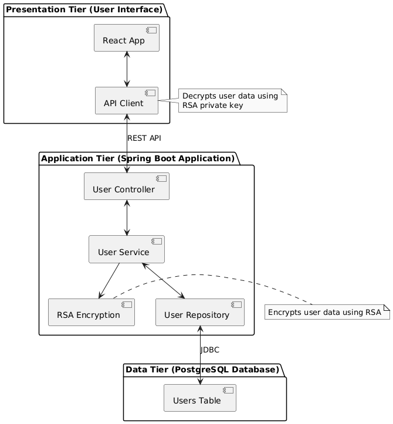
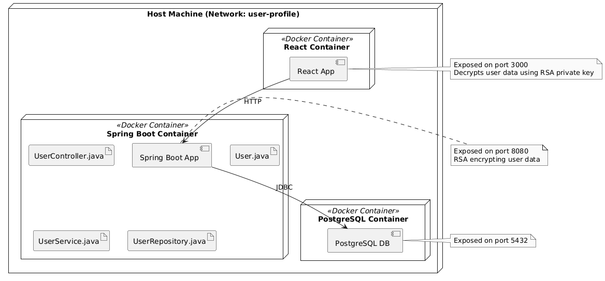

# User Profile Application

A secure microservices-based user profile management system with encrypted data transmission between services.

## Overview

This project demonstrates a secure approach to handling user profile data by implementing RSA encryption between services. The application consists of:

- **Spring Boot Backend**: REST API with PostgreSQL integration
- **React Frontend**: User interface to fetch and display encrypted user data
- **PostgreSQL Database**: Data storage for user profiles
- **Docker**: Containerization for easy deployment

## Architecture

### Logical Architecture


### Physical Architecture


## Technologies Used

- **Backend**: Spring Boot 3.5, JPA, PostgreSQL
- **Frontend**: React 19, Web Crypto API
- **Security**: RSA Encryption (OAEP with SHA-256)
- **Containerization**: Docker, Docker Compose
- **Build**: Maven (backend), npm (frontend)

## Setup Instructions

### Prerequisites

- Java 21
- Node.js
- Docker and Docker Compose
- Maven

### Local Development Setup

1. **Backend (Spring Boot)**
   ```bash
   cd userprofile
   ./mvnw clean package -DskipTests
   ./mvnw spring-boot:run
   ```

2. **Frontend (React)**
   ```bash
   cd userprofile-client
   npm install
   npm start
   ```

3. **Database (PostgreSQL)**
   ```bash
   # Run PostgreSQL locally
   docker run -d -p 5432:5432 -e POSTGRES_DB=userprofile -e POSTGRES_USER=postgres -e POSTGRES_PASSWORD=nguyenkhang postgres
   
   # Initialize database
   docker exec -i <container_id> psql -U postgres -d userprofile < postgres/init.sql
   ```

### Docker Deployment

1. **Build and run the entire application stack**
   ```bash
   # Build the Spring Boot application first
   cd userprofile
   ./mvnw clean package -DskipTests
   
   # Go back to root and run Docker Compose
   cd ..
   docker compose up --build -d
   ```

2. **Access the application**
   - Frontend: http://localhost:3000
   - Backend API: http://localhost:8080/api/users/{userId}

## Usage

1. Open the frontend application at http://localhost:3000
2. Enter a user ID (0 or 1 are pre-loaded in the database)
3. Click "Fetch User" to retrieve the encrypted user data
4. The application will decrypt and display the user information

## Security Features

This application demonstrates several security concepts:

1. **Data Encryption**: User data is encrypted using RSA with OAEP padding and SHA-256 hash algorithm
2. **Secure Communication**: Sensitive data is protected during transmission between services
3. **Key Management**: Public/private key pairs for asymmetric encryption

## Troubleshooting

### Database Connection Issues
If the application can't connect to the database, ensure:
- Database container is running (`docker ps`)
- Connection strings in `userprofile/src/main/resources/application.yml` match the Docker Compose configuration
- Port mappings are correct (5432 inside container, 5431 on host)

### RSA Encryption/Decryption Issues
If encryption/decryption fails:
- Verify that the public and private keys are properly loaded
- Check that the encryption/decryption algorithms match between frontend and backend

## Project Structure

```
user-profile/
├── diagram/                    # Architecture diagrams
├── postgres/                   # PostgreSQL Docker setup
│   ├── Dockerfile
│   └── init.sql                # Database initialization
├── userprofile/                # Spring Boot Backend
│   ├── src/                    # Source code
│   ├── pom.xml                 # Maven configuration
│   └── Dockerfile              # Docker configuration
├── userprofile-client/         # React Frontend
│   ├── src/                    # Source code
│   ├── package.json            # npm configuration
│   └── Dockerfile              # Docker configuration
└── docker-compose.yaml         # Docker Compose configuration
```